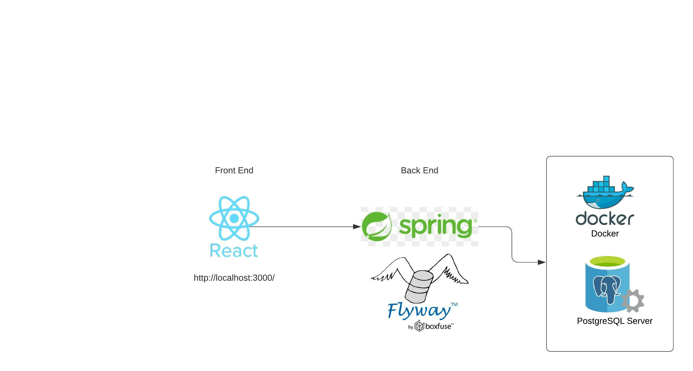
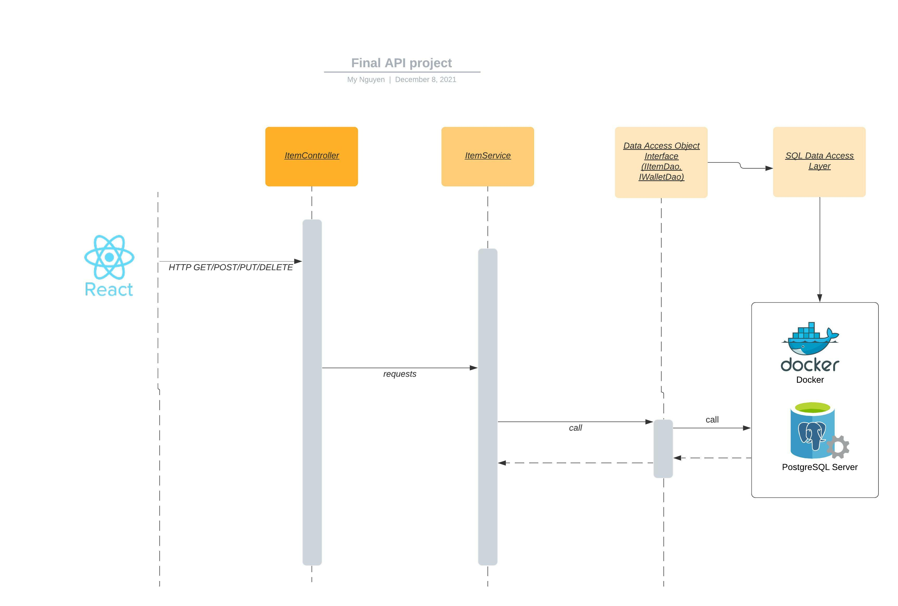
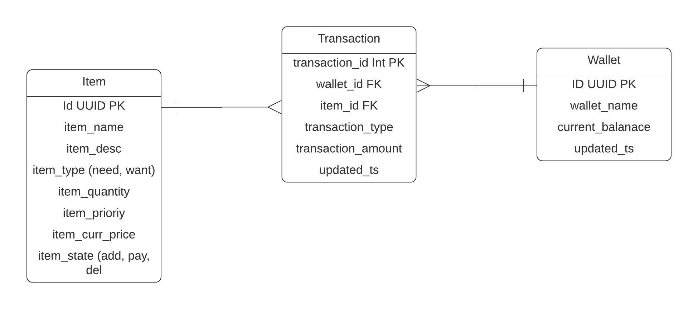
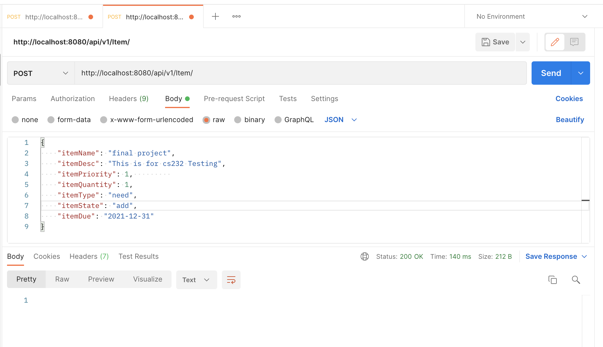
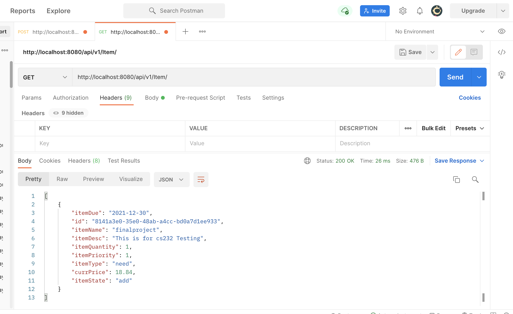
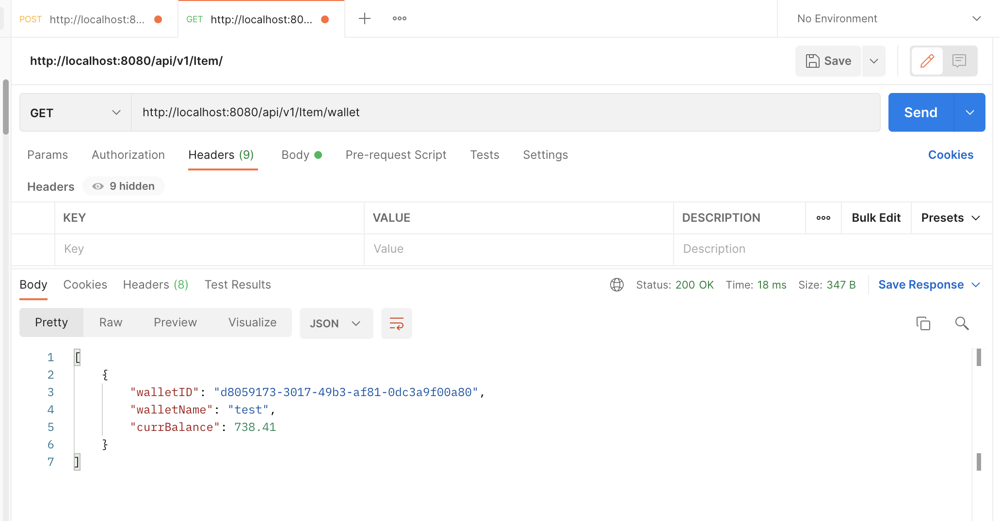
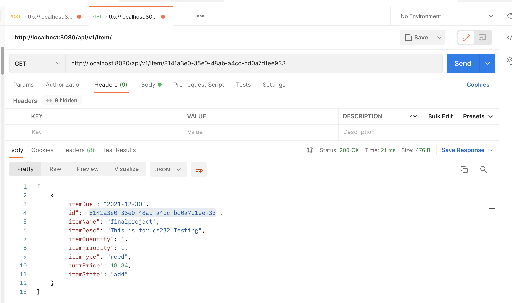
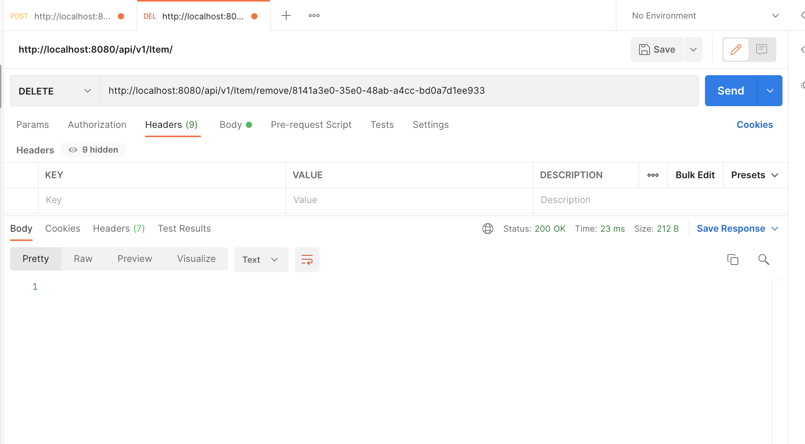
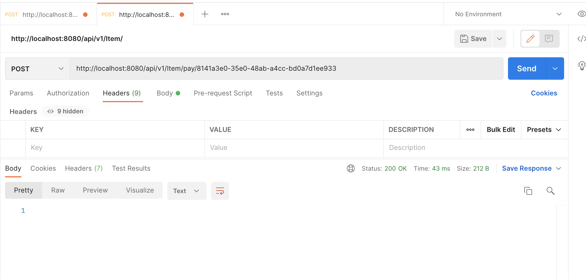
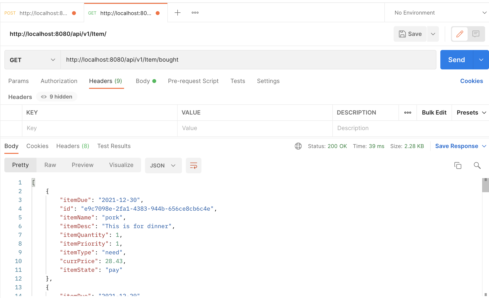

# Architecture
For this application, we use the following stack:
****
**Front-End:** React  
**Back-End:** SpringBoot + TomCat Server  
**Database:** PostgreSQL (Alpine)  
**Container:** Docker  
**Database Migration:** Flyway  

Here's the architechture diagram  


****
API Calls Sequence  

  

# Frontend
For the front end, we're using React frameword, dependencies are managed by `node package manager` (npm). The entire web application is written in HTML, CSS and JavaScript

## Application Layer
```javascript
const PaidItems ():
    const [items, setItems]
    const fetchItem = () => {
        axios.get("http://localhost:8080/api/v1/Item/bought")
    }

    const renderCard = (card, index)
    return items.map(renderCard)

const Wallet ():
    const [items, setItems]
    const fetchItem = () => {
        axios.get("http://localhost:8080/api/v1/Item/wallet") 
    }
    const renderCard = (card, index)
    return items.map(renderCard)

class ActiveItems extends Component {
  constructor(props) {
    super(props)
    this.state = {
      items: []
    }
  }
  componentDidMount() {
    axios.get("http://localhost:8080/api/v1/Item")
  }

  removeItem = (card, e) => {
    axios.delete(`http://localhost:8080/api/v1/Item/remove/${card.id}`)
  }

  payItem = (card, e) => {
    axios.post(`http://localhost:8080/api/v1/Item/pay/${card.id}`)
  }

  renderCard = (card, index)
  render()
}

class CreateItem extends Component {
  constructor(props) {
    super(props)
    this.state = {
      itemName: '',
      itemDesc: '',
      itemPriority: '',           
      itemQuantity: '',
      itemState: 'add',
      itemType: 'need',
      itemDue: ''
    }
  }

  changeHandler = (e)
  onDateChange = (date)


  submitHandler = e:
    axios.post("http://localhost:8080/api/v1/Item/", this.state)
    
  render()
}
```

# Backend Service
For the back-end, we use a Java based framework, Spring Boot. There are a few important component of the backend

UML Diagram


## Service Application Layer
This is part of Spring Boot framework. This Layer provides the entry to the backend

```java
@SpringBootApplication
public class ApidemoApplication {
	public static void main(String[] args) 
        run application
}
```

## Controller
This layer receives requests from the Tomcat server and maps the REST API endpoints to the service

```java
@RequestMapping("api/v1/Item")
public class ItemController {
    private ItemService itemService;

    @Post
    public void addItem(ItemNeed itemNeed) {
        call itemService.addItem(itemNeed)
    }

    @Get
    public List<ItemNeed> getAllItem() {
        call itemService.getAllItem()
    } 

    @Get("/wallet")
    public List<Wallet> getWallet() {
        call itemService.getWallet();
    }

    @Get("/{itemId}")
    public List<ItemNeed> getItem(UUID itemId) {
        call itemService.getItem(itemId);
    }

    @Get("/bought")
    public List<ItemNeed> getPaidItem() {
        call itemService.getPaidItem();
    }

    @Delete("/remove/{itemId}")
    public void removeItem(UUID itemId) {
        call itemService.removeItem(itemId);
    }
    
    @Post("/pay/{itemId}")
    public void payForItem(UUID itemId) {
        call itemService.payForItem(itemId);
    }
}
```


## Service

This class handles all the service call from the Controller. It does 2 things: 
+ Perform any business logics before passing data to Data Access Layer or before returning to
the Controller (caller)
+ Ask the Data Access Layer for data from the Database or transfering payload data
to the Data Access Layer


```java
public class ItemService {
    private final IItemDao<ItemNeed, UUID> itemDao;
    private final IWalletDao walletDao;

    public List<ItemNeed> getAllItem() {
        return itemDao.findAllItem();;
    }

    public List<ItemNeed> getPaidItem() {
        return itemDao.findPaidItem()
    }

    public void addItem(ItemNeed itemNeed) {
        UUID id = generate UUID
        itemNeed.setCurrPrice(generatePrice());
        itemNeed.setItemName(checkString(itemNeed.itemName));  // remove special chars

        call checkNegativeNumber(itemNeed.itemQuantity)
        call checkNegativeNumber(itemNeed.itemPriority)
        call itemDao.addItem(id, itemNeed);        
    }

    public void removeItem(UUID itemId) {
        List<ItemNeed> itemNeeds = call getItem(itemId);
        
        if (itemNeeds.size()==0):
            throw new NonExistingIDException()
            call itemDao.removeItemByID(itemId)
    }

    public List<ItemNeed> getItem(UUID itemId) {
        return itemDao.findItemByID(itemId);
    }


    public List<Wallet> getWallet() {
        return walletDao.getCurrWallet();
    }

    public void payForItem(UUID itemId) {
        String transType = "pay"
        Wallet wallet = call getWallet()
        ItemNeed itemNeed = getItem(itemId)

        if (itemNeed.getItemName().isBlank()) {
            throw NonExistingIDException();
        }
        
        double amount = getItem(itemId).currPrice;

        if (amount < wallet.getCurrBalance()) {
            throw NegativeBalanceException();
        }
        call walletDao.updateTransaction(wallet.ID, 
                                        itemId, 
                                        transType, 
                                        amount);
    }


    private double generatePrice () {
        return random of [15, 30]
    }


    private String checkString(String inputString) {
        replace non alphabetical from inputString
    }

    private void checkNegativeNumber(int inputValue) throws NegativeNumberException {
        if inputValue < 0:
            throw NegativeNumberException();
        
    }
}

```

## Data Access Layer
Data Access Layer handle all request from the Service for data. It establish connection to database, and query the database for data. Currently, the `SQLItemDataAccessService` connects to the PostgreSQL database. It implements 2 interfaces,the `IItemDao` and `IWalletDao`

```java
public class SQLItemDataAccessService implements IItemDao<ItemNeed, UUID>, IWalletDao {
    private final JdbcTemplate jdbcTemplate; 

    @Autowired
    public SQLItemDataAccessService(JdbcTemplate jdbcTemplate) {
        this.jdbcTemplate = jdbcTemplate;
    }
    
    public List<ItemNeed> findAllItem() throws SQLException {
        query jdbcTemplate for all active Item
        map each row to new ItemNeed
        return List<ItemNeed>
    }

    public List<ItemNeed> findPaidItem() {
        query jdbcTemplate for all paid Item
        map each row to new ItemNeed
        return List<ItemNeed>
    }

    public List<ItemNeed> findItemByID(UUID id) {
        query jdbcTemplate for id
        map each row to new ItemNeed
        return List<ItemNeed>
    }

    public boolean addItem(UUID id, ItemNeed entity) throws SQLException{
        Date date= get current date
        call jdbcTemplate to insert new ItemNeed to item
        return true;
    }

    public void changeItemStateToPay(final UUID entityID) {
        String item_state = 'pay'
        call jdbcTemplate to update item by entityID
        set item_state = item_state
    }

    public void removeItemByID(UUID entityID) {
        String item_state = "del"
        call jdbcTemplate to update item by entityID 
        set item_state = item_state
    }

    public List<Wallet> getCurrWallet() {
        query jdbcTemplate for wallet
        map each row to new Wallet
        return List<Wallet>
    }

    @Override
    public boolean updateTransaction(UUID walletId, 
                                    UUID itemId, 
                                    String transType, 
                                    double amount) {
        call jdbcTemplate for stored proc trans_item_test
        return true;
    }
}

```

## Row Mapper
This is a helper class that translate the SQL ResultSet to the java Object Model

```java
public class ItemRowMapper implements RowMapper<ItemNeed> {
    @Override
    public ItemNeed mapRow(ResultSet rs, int rowNum) throws SQLException {
        ItemNeed itemNeed = new ItemNeed();
        itemNeed.setId(UUID.fromString(rs.getString("id")));
        itemNeed.setItemName(rs.getString("item_name"));
        itemNeed.setItemDesc(rs.getString("item_desc"));
        itemNeed.setItemType(rs.getString("item_type"));
        itemNeed.setItemQuantity(rs.getInt("item_quantity"));
        itemNeed.setItemPriority(rs.getInt("item_prioriy"));
        itemNeed.setCurrPrice(rs.getDouble("item_curr_price"));
        itemNeed.setItemState(ItemState.valueOf(rs.getString("item_state")));
        itemNeed.setDueDate(rs.getDate("item_due_date"));
        return itemNeed;
    }
}
```

## Data Model
The datamodel defines attributes for Item and Wallet, the column names they maps to in SQL server, and the Json Property they map to in the payload

```java
public abstract class Item {
    @Id
    @GeneratedValue(strategy = GenerationType.AUTO) 
    private UUID id;

    @Column(name="item_name", nullable=false,length=25)
    private String itemName;

    @Column(name="item_desc", length=225)
    private String itemDesc;

    @Column(name="item_quantity")
    private int itemQuantity;

    @Column(name="item_priority", nullable = false)
    private int itemPriority;

    @Column(name="item_type", nullable = false)
    private String itemType;

    @Column(name="item_curr_price")
    private double currPrice;

    @Enumerated(EnumType.STRING)
    private ItemState itemState; 
}
```


```java
public class ItemNeed extends Item{
    @Column(name="item_due_date")
    private Date dueDate; 
}
```

```java
public class Wallet {
    @Id
    @Column(name="id")
    @GeneratedValue(strategy = GenerationType.AUTO)
    private UUID id;

    @Column(name="wallet_name")
    private String walletName;

    @Column(name="current_balanace", nullable=false)
    private double currBalance;
}
```

## Datasource
This is the class that defines the connection and has the connection builder. This class is a @Bean of the Spring Boot framework, meaning Spring Boot instantiate and manages it for the DAO at initialization

```java
public class PostgresDatasource {
    @Bean
    @ConfigurationProperties("app.datasource")
    public HikariDataSource hikariDataSource() {
        return DataSourceBuilder.create().type(HikariDataSource.class).build();
    }
}
```

# Database
Here's the ERD  



# Testing

To test for the API, we're going to test each endpoint with Postman

**Test: API endpoint Post(/v1/api/Item)
Expect: Status 200  


**Test: API endpoint Get(/v1/api/Item)
Expect: Status 200  


**Test: API endpoint Get(/v1/api/Item/wallet)
Expect: Status 200  


**Test: API endpoint Get(/{itemId})
Expect: Status 200  


**Test: API endpoint Delete("/remove/{itemId}")
Expect: Status 200  


**Test: API endpoint Post("/pay/{itemId}")
Expect: Status 200


**Test: API endpoint Get("/bought")
Expect: Status 200


